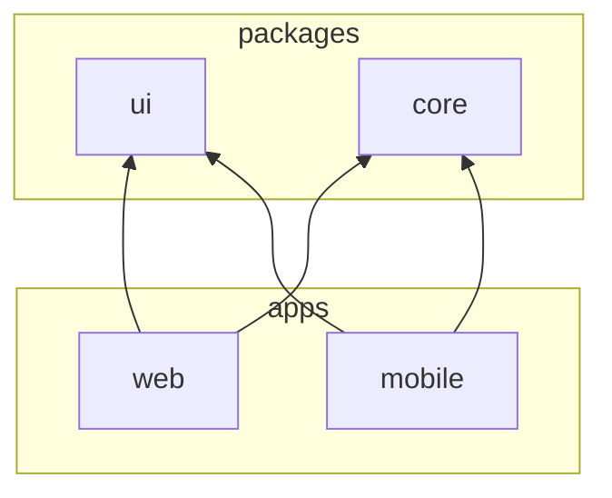

# Messenger Monorepo

Монорепозиторий для мессенджера на базе pnpm + Turborepo.

## Структура

```
.
├── apps/
│   ├── web/              # Приложение для веба
│   └── mobile/           # Приложение для мобилки
├── packages/
│   ├── core/             # Общая бизнес-логика
│   └── ui/               # UI kit
```

## Зависимости между слоями



## Технологии

- **pnpm** + **Turborepo** + **TypeScript** — монорепозиторий
- **Vite** + **React** + **TanStack Router** — web
- **Expo** + **React Native** — mobile
- **@tanstack/react-query** + **zustand** — core
- **tsdown** + **React** + **React Native** + **@vanilla-extract/css** — ui 
- **ESLint** + **Prettier** — линтинг, форматирование

## Установка пакетов

```bash
pnpm install              
```
Создать в корне проекта файл `.env` и заполнить его по примеру `.env.example`

## Команды

### Разработка

```bash
pnpm run dev              
```

### Сборка dist артефактов

```bash
pnpm run build           
```

### Линтинг и проверка типов

```bash
pnpm run lint             
pnpm run typecheck        
```

### Форматирование

```bash
pnpm run format           
pnpm run format:check     
```

### Синхронизация версий

```bash
pnpm syncpack:list        # Показать рассинхронизированные версии пакетов
pnpm syncpack:fix         # Синхронизировать версии пакетов
```

### Очистка dist артефактов

```bash
pnpm clean                
```

## Структура пакетов

### core

#### Назначение

Общая бизнес-логика, состояние и API-слой, переиспользуемый для web и mobile.

#### Структура

```
packages/core/
└── src/
    ├── modules/               # Модули (auth, posts, chat, user и т.д.)
    │   └── {module}/
    │       ├── model/         # Zustand stores + локальные типы
    │       │   ├── store.ts
    │       │   └── types.ts
    │       ├── api/           # TanStack Query + HTTP-клиент
    │       │   ├── {module}Api.ts
    │       │   └── {module}Queries.ts
    │       ├── hooks/         # UI-агностичные hooks
    │       │   ├── useLogin.ts
    │       │   ├── useLogout.ts
    │       │   └── useAuthUser.ts
    │       ├── lib/           # Чистая бизнес-логика, helpers
    │       │    ├── {module}Mapper.ts
    │       │    └── {module}Validators.ts
    │       └──  index.ts      # Public API {module}
    │
    ├── shared/                # Общая инфраструктура для всех модулей
    │   ├── api/
    │   │   ├── httpClient.ts  # axios/fetch-обёртка
    │   │   └── endpoints.ts
    │   ├── store/
    │   │   ├── appStore.ts
    │   │   └── middlewares.ts
    │   ├── config/
    │   │   └── env.ts
    │   └── lib/
    │       └── date.ts
    │          
    └── index.ts               # Public API core
```

### ui

#### Назначение

UI-библиотека (по Atomic Design) с поддержкой платформо-специфичных реализаций для web и mobile.

#### Структура

```
packages/ui/src/
├── index.ts                    # Public API для web
├── index.native.ts             # Public API для mobile
│
├── components/                 # Компоненты UI
│   ├── index.ts                # Экспорт web-компонентов
│   ├── index.native.ts         # Экспорт mobile-компонентов
│   │
│   ├── atoms/                  # Базовые элементы (Button, Typography, Flex...)
│   │   ├── index.ts            # Экспорт web-атомов
│   │   ├── index.native.ts     # Экспорт mobile-атомов
│   │   └── {Atom}/
│   │       ├── index.ts        # Экспорт web-версии
│   │       ├── index.native.ts # Экспорт mobile-версии
│   │       ├── tokens.ts       # Общие токены (используются web и mobile)
│   │       ├── types.ts        # Общие типы (базовые пропсы)
│   │       ├── web/            # Web-реализация
│   │       │   ├── {Atom}.tsx  # React компонент
│   │       │   ├── {Atom}.css.ts # Стили (vanilla-extract)
│   │       │   └── index.ts
│   │       └── mobile/         # Mobile-реализация
│   │           ├── {Atom}.tsx  # React Native компонент
│   │           ├── {Atom}.styles.ts # Стили (StyleSheet)
│   │           └── index.ts
│   │
│   ├── molecules/              # Комбинации атомов
│   ├── organisms/              # Сложные блоки UI
│   │
│   └── ThemeProvider/          # Провайдер тем
│       ├── context.ts          # React Context для темы
│       ├── types.ts            # Типы провайдера
│       ├── web/
│       │   ├── ThemeProvider.tsx
│       │   ├── themes.css.ts   # vanilla-extract темы
│       │   ├── styles/         # Глобальные стили
│       │   │   ├── globals.css.ts
│       │   │   └── reset.css.ts
│       │   └── index.ts
│       └── mobile/
│           ├── ThemeProvider.tsx
│           └── index.ts
│
├── tokens/                     # Дизайн-токены
│   ├── index.ts
│   ├── themes.ts               # Токены тем (цвета...)
│   ├── typography.ts           # Токены типографики
│   └── spacing.ts              # Токены отступов
│
├── types/                      # Общие типы
│   ├── index.ts
│   ├── themes.ts               # Типы тем
│   ├── typography.ts           # Типы типографики
│   ├── spacing.ts              # Типы отступов
│   └── scale.ts                # Типы масштабирования
│
├── sprinkles/                  # Sprinkles (atomic CSS utilities)
│   ├── index.ts
│   ├── web/
│   │   ├── spacing.css.ts
│   │   └── index.ts
│   └── mobile/
│       ├── spacing.ts
│       └── index.ts
│
└── libs/                       # Вспомогательные утилиты
    ├── index.ts
    └── mobile/
        ├── nativeSprinkles.ts  # Sprinkles для React Native
        └── index.ts
```

### web

#### Назначение

SPA на Vite + TanStack Router

#### Структура

```
apps/web/
├── index.html                  # Entry point HTML
├── vite.config.ts              # Vite конфигурация
└── src/
    ├── main.tsx                # Entry point React
    ├── routes/                 # TanStack Router (file-based)
    │   ├── __root.tsx          # Корневой layout
    │   ├── index.tsx           # /
    │   ├── login.tsx           # /login
    │   └── chat/
    │       ├── route.tsx       # /chat layout
    │       ├── index.tsx       # /chat
    │       └── $id.tsx         # /chat/:id
    ├── modules/                # Фичи приложения
    └── shared/                 # Общие компоненты
```
### mobile

#### Назначение

Нативное приложение на Expo

#### Структура

```
apps/mobile/
├── index.ts                    # Entry point (registerRootComponent)
├── app.json                    # Expo конфигурация
└── src/
    ├── App.tsx                 # Корневой компонент
    ├── screens/                # Expo Router / stack / screens
    │   ├── LoginScreen.tsx
    │   ├── HomeScreen.tsx
    │   └── ChatScreen.tsx
    │
    ├── modules/
    │   ├── auth/
    │   │   ├── ui/             # RN-компоненты, использующие core + ui
    │   │   ├── model/
    │   │   ├── lib/
    │   │   └── index.ts
    │   ├── chat/
    │   └── ...
    │
    └── shared/
        ├── ui/                 # mobile-специфичные общие компоненты
        ├── hooks/
        └── lib/
```

## Требования

- Node.js >= 22.21.1
- pnpm >= 10.0.0
